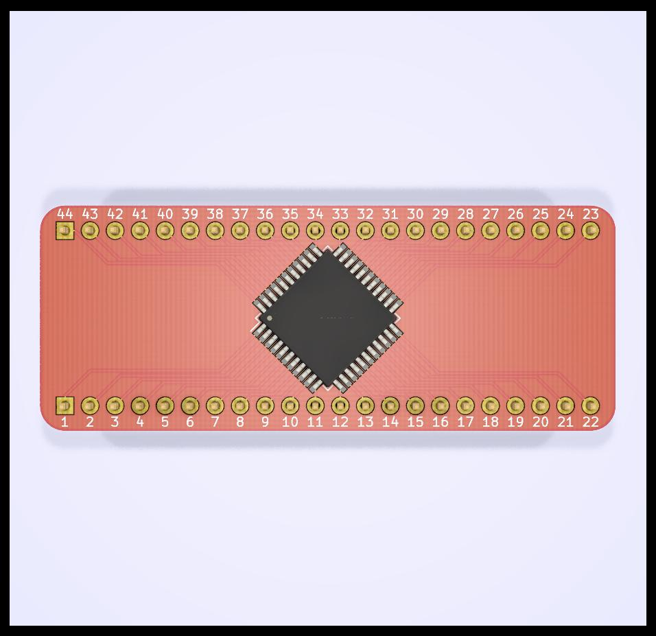
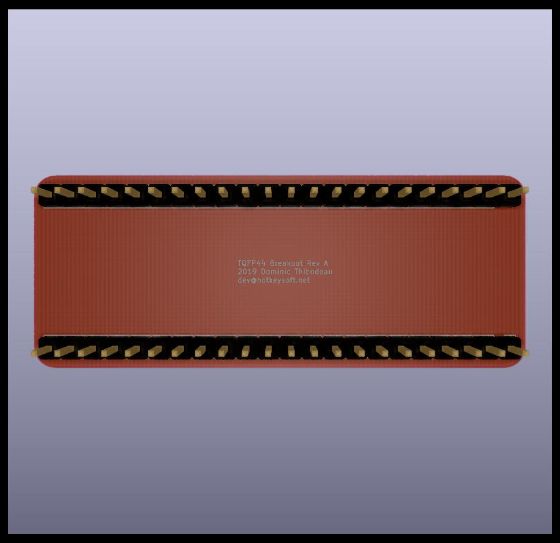

# TQFP44 Breakout Board
Rev A October 2019

As simple as it gets.

Images
============
|Front                                                 | Back                                              |
|------------------------------------------------------|---------------------------------------------------|
|||

### Schematics (pdf)
- [Complete schematics](./img/schema.pdf)

### PCB Images (svg)
- [Top](./img/pcb-front.svg)
- [Bottom](./img/pcb-back.svg)
